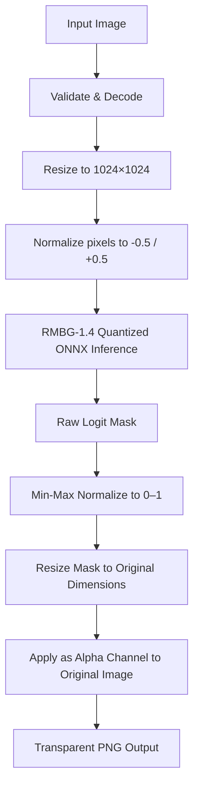

# G-Remover Backend API

A high-performance, modular backend API built with Rust using the [Axum](https://github.com/tokio-rs/axum) web framework, [Tokio](https://tokio.rs/) async runtime, and [MongoDB](https://www.mongodb.com/) database storage.

## Tech Stack
- **Framework**: Axum (v0.7)
- **Async Runtime**: Tokio
- **AI Inference Engine**: ONNX Runtime via [ort](https://github.com/pykeio/ort) (v2.0.0-rc.12)
- **Machine Learning Model**: `BRIA RMBG-1.4` (ISNet-based, 8-bit quantized, ~42 MB)
- **Database**: MongoDB
- **Authentication**: Bcrypt password hashing & JSON Web Tokens (JWT) (Optional)
- **Logging**: Tracing & Tracing-Subscriber
- **Configuration**: Dotenvy
- **CORS/Request Logging**: Tower & Tower-HTTP
- **Error Handling**: Thiserror
- **Image Processing**: [image](https://github.com/image-rs/image) & [ndarray](https://github.com/rust-ndarray/ndarray) for tensor manipulation

---

## AI Background Removal Pipeline

The background extraction pipeline uses a **single-model architecture** powered by the BRIA RMBG-1.4 quantized model, running entirely on CPU within a ~80 MB memory footprint — well within Render's 512 MB free tier.



### Inference Pipeline Details

#### Step 1: Preprocessing
- The input image is resized to $1024 \times 1024$ pixels using a Triangle filter.
- Channel intensities are normalized using mean `[0.5, 0.5, 0.5]` and standard deviation `[1.0, 1.0, 1.0]`, mapping pixel values to the $[-0.5, +0.5]$ range.
- The data is structured into a $1 \times 3 \times 1024 \times 1024$ `f32` tensor.

#### Step 2: Inference
- The tensor is fed into the **BRIA RMBG-1.4** 8-bit quantized ONNX model (~42 MB), held persistently in a shared `Arc<Mutex<Session>>`.
- The CPU execution provider is configured with the arena allocator **disabled**, ensuring unused memory is immediately returned to the OS after each request.
- The model outputs a $1 \times 1 \times 1024 \times 1024$ raw logit mask.

#### Step 3: Postprocessing
- The raw logits are **min-max normalized** to the $[0, 1]$ range.
- The mask is resized back to the original image dimensions.
- The mask is applied as the **alpha channel** of the original (unresized) input image, preserving full colour fidelity.
- The final transparent PNG is returned.

### Model File Download

The model is not committed to the repository. Before running the server, download it into the `assets/` folder:

```bash
# Download RMBG-1.4 8-bit quantized model (~42 MB)
wget -O assets/rmbg-1.4.onnx "https://huggingface.co/briaai/RMBG-1.4/resolve/main/onnx/model_quantized.onnx"
```

> **Note**: The model is loaded once at server startup and kept resident in memory. With the 8-bit quantized model and arena allocator disabled, the server maintains a stable **~80 MB idle footprint** and peaks at **~150 MB** during inference — well within Render's 512 MB free tier limit.

---

## Directory Structure
```text
backend/
├── src/
│   ├── config.rs      # Environment variables configuration loader
│   ├── errors.rs      # Centralized error types and JSON API response mappings
│   ├── main.rs        # Application setup, DB connection, model loading, server boot
│   ├── state.rs       # Shared AppState struct (holds DB, JWT secret, ONNX session)
│   ├── middleware/    # CORS policies and network logging layers
│   │   └── mod.rs
│   ├── models/        # Database document models
│   │   ├── mod.rs
│   │   └── user.rs
│   └── routes/        # Router configuration and API handlers
│       ├── mod.rs
│       ├── remove.rs  # Background removal handler (RMBG-1.4 inference pipeline)
│       └── auth.rs    # User registration and login handlers
├── assets/
│   ├── .gitkeep       # Ensures the assets/ directory is tracked by Git
│   └── rmbg-1.4.onnx # Downloaded separately (not committed)
├── .env               # Local environment settings
└── Cargo.toml         # Dependency configurations
```

---

## Getting Started

### Prerequisites
Make sure Rust and Cargo are installed. If not, install them using:
```bash
curl --proto '=https' --tlsv1.2 -sSf https://sh.rustup.rs | sh
```

### Installation & Run

1. **Clone/Navigate to project**:
   ```bash
   cd backend
   ```

2. **Configure environment**:
   Create a `.env` file (which is ignored by Git via `.gitignore`):
   ```env
   HOST=127.0.0.1
   PORT=8080
   RUST_LOG=backend=debug,tower_http=debug,axum=debug
   MONGODB_URI=mongodb+srv://...
   MONGODB_DB_NAME=g_remover
   JWT_SECRET=your_jwt_secret_key
   ```

3. **Download the AI Model** (one-time setup):
   ```bash
   wget -O assets/rmbg-1.4.onnx "https://huggingface.co/briaai/RMBG-1.4/resolve/main/onnx/model_quantized.onnx"
   ```

4. **Run in Development** (from the `backend/` directory):
   ```bash
   cargo run
   ```

5. **Verify API Endpoints**:
   - Liveness Check: `http://127.0.0.1:8080/api/health`
   - Metadata / Info: `http://127.0.0.1:8080/api/info`

---

## API Endpoints

### 1. `GET /api/health`
Checks whether the service is alive and reachable.
**Response (JSON)**:
```json
{
  "status": "ok",
  "timestamp": 1716382000,
  "service": "g-remover-backend"
}
```

### 2. `GET /api/info`
Returns general application metadata, framework, runtime environment, and available routes.

### 3. `POST /api/auth/register`
Creates a new user profile with password encryption (Bcrypt).
**Request Body (JSON)**:
```json
{
  "email": "user@example.com",
  "password": "securepassword123"
}
```
**Response (201 Created)**:
```json
{
  "status": "success",
  "message": "User registered successfully"
}
```

### 4. `POST /api/auth/login`
Validates user credentials and issues a signed JSON Web Token (JWT).
**Request Body (JSON)**:
```json
{
  "email": "user@example.com",
  "password": "securepassword123"
}
```
**Response (200 OK)**:
```json
{
  "token": "eyJhbGciOiJIUzI1NiIsInR5cCI6IkpXVCJ9...",
  "token_type": "Bearer"
}
```

---

## Testing & Compiling

- **Check compilation**:
  ```bash
  cargo check
  ```
- **Run test suites**:
  ```bash
  cargo test
  ```
- **Build production bundle**:
  ```bash
  cargo build --release
  ```
