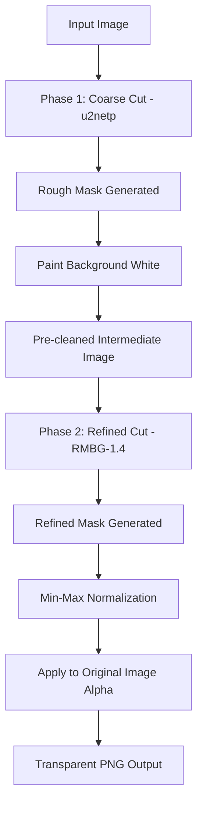

# G-Remover Backend API

A high-performance, modular backend API built with Rust using the [Axum](https://github.com/tokio-rs/axum) web framework, [Tokio](https://tokio.rs/) async runtime, and [MongoDB](https://www.mongodb.com/) database storage.

## Tech Stack
- **Framework**: Axum (v0.7)
- **Async Runtime**: Tokio
- **AI Inference Engine**: ONNX Runtime via [ort](https://github.com/pykeio/ort) (v2.0.0-rc.12)
- **Machine Learning Model**: `BRIA RMBG-1.4` (ISNet-based high-accuracy background removal model)
- **Database**: MongoDB
- **Authentication**: Bcrypt password hashing & JSON Web Tokens (JWT) (Optional)
- **Logging**: Tracing & Tracing-Subscriber
- **Configuration**: Dotenvy
- **CORS/Request Logging**: Tower & Tower-HTTP
- **Error Handling**: Thiserror
- **Image Processing**: [image](https://github.com/image-rs/image) & [ndarray](https://github.com/rust-ndarray/ndarray) for tensor manipulation

---

## AI Background Removal Pipeline

The background extraction pipeline utilizes a hybrid **Two-Phase Background Removal Pipeline** to achieve both speed and high-precision detail (such as fine hair and complex object edges).



### Inference Pipeline Details

#### Phase 1: Coarse Segmentation (u2netp)
1. **Preprocessing**:
   - The input image is resized to $320 \times 320$ pixels.
   - Channel intensities are normalized using standard ImageNet mean `[0.485, 0.456, 0.406]` and standard deviation `[0.229, 0.224, 0.225]`.
   - The data is structured into a $1 \times 3 \times 320 \times 320$ float tensor.
2. **Inference**:
   - The tensor is processed by **u2netp** (~4.7 MB) via a shared ONNX session.
   - This produces a low-resolution, high-contrast rough probability mask.
3. **Composite Masking**:
   - The rough mask is resized back to the original image dimensions.
   - Pixels considered background (alpha < 128) are painted pure white, while original foreground pixels are kept. This creates a pre-cleaned, high-contrast intermediate image.

#### Phase 2: High-Resolution Edge Refinement (RMBG-1.4)
1. **Preprocessing**:
   - The pre-cleaned intermediate image is resized to $1024 \times 1024$ pixels.
   - Channel intensities are normalized using mean `[0.5, 0.5, 0.5]` and standard deviation `[1.0, 1.0, 1.0]`, mapping values to the $[-0.5, +0.5]$ range.
   - The data is shaped into a $1 \times 3 \times 1024 \times 1024$ float tensor.
2. **Inference**:
   - The tensor is processed by the **BRIA RMBG-1.4 8-bit quantized model** (~43 MB) via an on-demand ONNX session.
   - Because the background was already pre-cleaned in Phase 1, RMBG-1.4 focuses its full resolution on detail refinement, alpha matting, and edge smoothing.
3. **Postprocessing**:
   - The $1024 \times 1024$ raw logit mask output by RMBG-1.4 is **min-max normalized** to the $[0, 1]$ range.
   - The normalized mask is resized back to the original image dimensions and applied directly to the alpha channel of the **original input image** (ensuring perfect color fidelity).
   - The final transparent PNG is returned.

### Model Files Download

The model files are not committed to the repository. Before running the server, download them into the `assets/` folder:

```bash
# Download Phase 1 model (u2netp)
wget -O assets/u2netp.onnx "https://github.com/danielgatis/rembg/releases/download/v0.0.0/u2netp.onnx"

# Download Phase 2 model (RMBG-1.4 8-bit quantized)
wget -O assets/rmbg-1.4.onnx "https://huggingface.co/briaai/RMBG-1.4/resolve/main/onnx/model_quantized.onnx"
```

> **Note**: Both models are loaded **on-demand** and automatically dropped after inference, rather than held persistently in memory. Coupled with the 8-bit quantized Phase 2 model, this keeps peak RAM footprint under **250 MB**, allowing the server to run perfectly on ultra-low-memory hosting (like Render's 512 MB free tier).

---

## Directory Structure
```text
backend/
├── src/
│   ├── config.rs      # Environment variables configuration loader
│   ├── errors.rs      # Centralized error types and JSON API response mappings
│   ├── main.rs        # Application setup, DB connection, server boot
│   ├── state.rs       # Shared AppState struct (holds DB connection & JWT secret)
│   ├── middleware/    # CORS policies and network logging layers
│   │   └── mod.rs
│   ├── models/        # Database document models
│   │   ├── mod.rs
│   │   └── user.rs
│   └── routes/        # Router configuration and API handlers
│       ├── mod.rs
│       └── auth.rs    # User registration and login handlers
├── .env               # Local environment settings
└── Cargo.toml         # Dependency configurations
```

---

## Getting Started

### Prerequisites
Make sure Rust and Cargo are installed. If not, install them using:
```bash
curl --proto '=https' --tlsv1.2 -sSf https://sh.rustup.rs | sh
```

### Installation & Run

1. **Clone/Navigate to project**:
   ```bash
   cd backend
   ```

2. **Configure environment**:
   Create a `.env` file (which is ignored by Git via `.gitignore`):
   ```env
   HOST=127.0.0.1
   PORT=8080
   RUST_LOG=backend=debug,tower_http=debug,axum=debug
   MONGODB_URI=mongodb+srv://...
   MONGODB_DB_NAME=g_remover
   JWT_SECRET=your_jwt_secret_key
   ```

3. **Download the AI Models** (one-time setup):
   ```bash
   wget -O assets/u2netp.onnx "https://github.com/danielgatis/rembg/releases/download/v0.0.0/u2netp.onnx"
   wget -O assets/rmbg-1.4.onnx "https://huggingface.co/briaai/RMBG-1.4/resolve/main/onnx/model_quantized.onnx"
   ```

4. **Run in Development** (from the `backend/` directory):
   ```bash
   cargo run
   ```

5. **Verify API Endpoints**:
   - Liveness Check: `http://127.0.0.1:8080/api/health`
   - Metadata / Info: `http://127.0.0.1:8080/api/info`

---

## API Endpoints

### 1. `GET /api/health`
Checks whether the service is alive and reachable.
**Response (JSON)**:
```json
{
  "status": "ok",
  "timestamp": 1716382000,
  "service": "g-remover-backend"
}
```

### 2. `GET /api/info`
Returns general application metadata, framework, runtime environment, and available routes.

### 3. `POST /api/auth/register`
Creates a new user profile with password encryption (Bcrypt).
**Request Body (JSON)**:
```json
{
  "email": "user@example.com",
  "password": "securepassword123"
}
```
**Response (201 Created)**:
```json
{
  "status": "success",
  "message": "User registered successfully"
}
```

### 4. `POST /api/auth/login`
Validates user credentials and issues a signed JSON Web Token (JWT).
**Request Body (JSON)**:
```json
{
  "email": "user@example.com",
  "password": "securepassword123"
}
```
**Response (200 OK)**:
```json
{
  "token": "eyJhbGciOiJIUzI1NiIsInR5cCI6IkpXVCJ9...",
  "token_type": "Bearer"
}
```

---

## Testing & Compiling

- **Check compilation**:
  ```bash
  cargo check
  ```
- **Run test suites**:
  ```bash
  cargo test
  ```
- **Build production bundle**:
  ```bash
  cargo build --release
  ```
